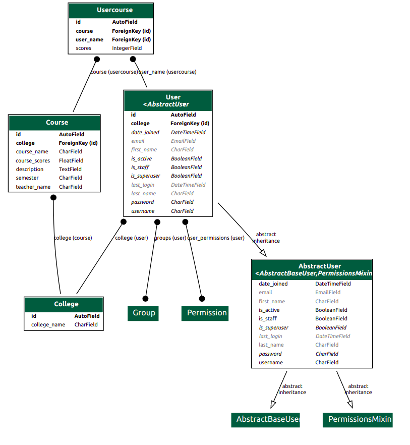
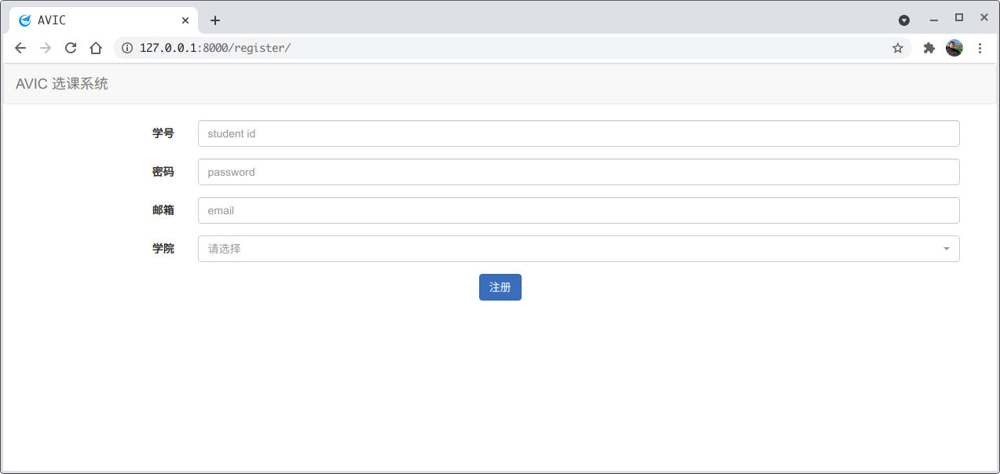
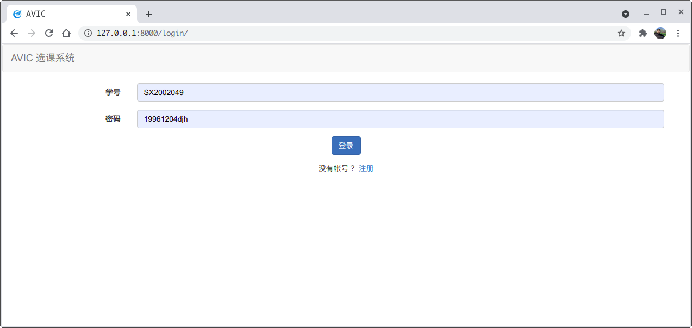
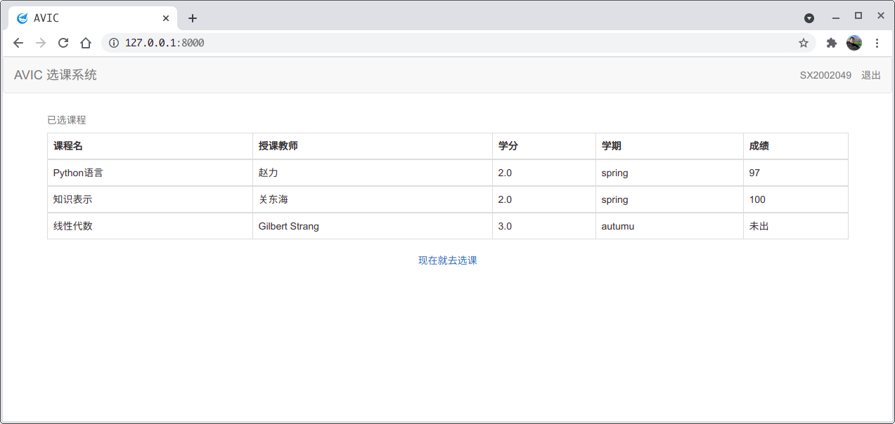
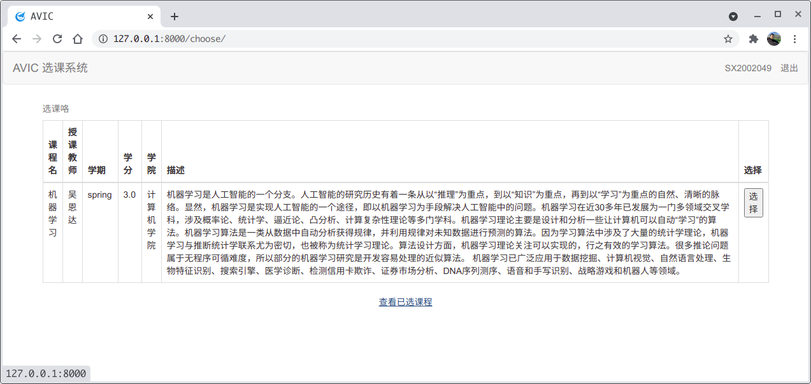
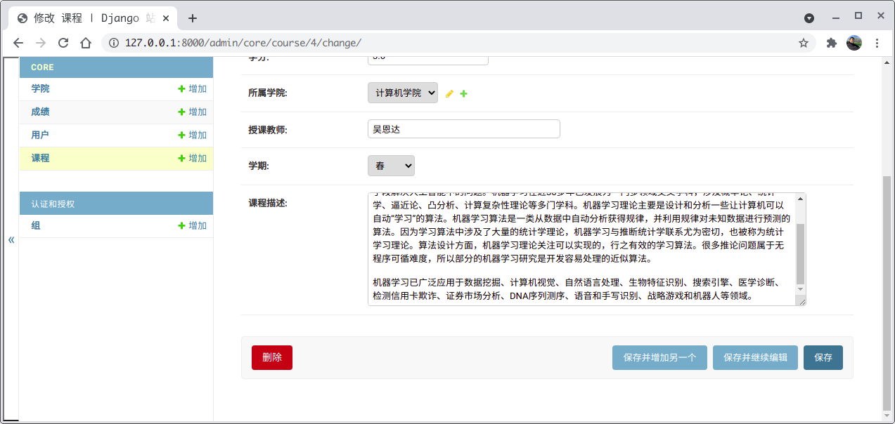

# 中国航空研究院选课系统

## 问题

- 学校选课似乎太依赖人工
- 不准确并且费时费人力
- 学生需要提供一份选课报告

因此我想做一个 `选课网站`， 方便学生和负责选课的老师

## 思路

Django 是高水准的 Python 编程语言驱动的一个开源模型，视图，控制器风格的Web应用程序框架，它起源于开源社区。组件十分丰富，程序员可以方便、快捷地创建高品质、易维护、数据库驱动的应用程序

因此我主要使用 Django 框架来实现

### 数据库

使用了 django 内置的 orm 模型， 只需要继承 `models.Model`类然后定义字段就可以

```Python
class Usercourse(models.Model):
    user_name = models.ForeignKey(User, on_delete=models.CASCADE, verbose_name="用户")
    course = models.ForeignKey(Course, on_delete=models.CASCADE, verbose_name="课程")
    scores = models.IntegerField(validators=[MaxValueValidator(100),
                                             MinValueValidator(0)], null=True, verbose_name="分数")

    class Meta:
        verbose_name = '成绩'
        verbose_name_plural = '成绩'

    def __str__(self):
        return str(self.user_name)
```

数据库模型：



### url

url可以分层，每一个url映射到不同的处理函数，由处理函数处理请求，并返回响应

顶层 url

```Python
urlpatterns = [
    path('', include('core.urls')),
    path('admin/', admin.site.urls),
]
```

第二层 url

```Python
urlpatterns = [
    path('', views.index, name='index'),
    path('login/', views.login, name='login'),
    path('lagout/', views.lagout, name='lagout'),
    path('register/', views.register, name='register'),
    path('choose/', views.choose, name="choose")
]
```

## 构建步骤

前置条件：

- mysql
- conda

安装 mysql

```
$ sudo apt-get install mysqlserver  // for linux
```

安装 miniconda

```
$ wget -c https://repo.continuum.io/miniconda/Miniconda3-latest-Linux-x86_64.sh // for linux
$ chmod 777 Miniconda3-latest-Linux-x86_64.sh
$ sh Miniconda3-latest-Linux-x86_64.sh
```

克隆代码
```
$ git clone https://github.com/ArdxWe/AvicCourseManagement.git
$ cd AvicCourseManagement
```

python环境
```
$ conda create -n avic python=3.8
$ conda activate avic
$ pip install django
$ pip install django_extensions
$ pip install mysql
```

运行

```
$ python manage.py runserver
```

## 功能

注册



登录



已选课程



选课



管理端



## 代码

https://github.com/ArdxWe/AvicCourseManagement


